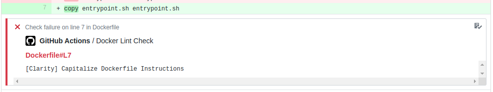

# Docker Lint Action

This is a GitHub action for running [dockerfilelint](https://github.com/replicatedhq/dockerfilelint) on docker files and annotating diffs with the linter output

## Example

```yaml
name: Lint
on: [push]
jobs:
  lint:
    runs-on: ubuntu-latest
    steps: 
    - name: Checkout
      uses: actions/checkout@master
    - name: lint
      uses: luke142367/Docker-Lint-Action@v1.0.0
      with:
        target: Dockerfile
      env:
        GITHUB_TOKEN: ${{ secrets.GITHUB_TOKEN }}
```
## Annotations

This action will also annotate your commits with the linting errors


## Usage

This is a list of the arguments this action can take:

| Name         | Required | Description                                                        |
|--------------|----------|--------------------------------------------------------------------|
| GITHUB_TOKEN | Yes      | This can simply be set to `${{secrets.GITHUB_TOKEN}}`              |
| target       | No       | This is a space separated list of targets to run Dockerfilelint on. By default this is set to 'Dockerfile' |
